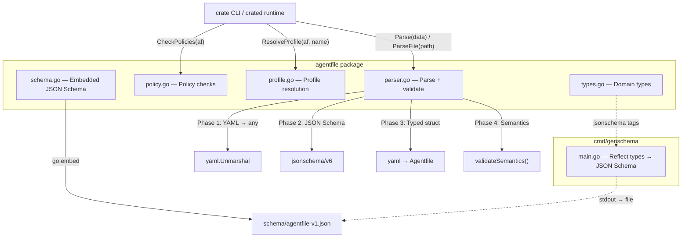

# Agentfile — Architecture

> Canonical Go implementation of the Agentfile v1 specification.
> Consumed as a library by [`crate`](https://github.com/agentcrate/crate) CLI and the `crated` runtime.

## Module Overview

```text
github.com/agentcrate/agentfile
```



## Parse Pipeline

`Parse(data []byte)` runs 4 sequential phases:

```text
┌─────────────────────────────────────────────────────┐
│ Phase 0: YAML → yaml.Node (preserves line numbers)  │
│ Phase 1: YAML → map[string]any → JSON Schema check  │
│ Phase 2: Schema errors → resolve source line numbers │
│ Phase 3: YAML → typed Agentfile struct               │
│ Phase 4: Semantic validation (cross-field checks)    │
└─────────────────────────────────────────────────────┘
```

**Phase 1** uses `santhosh-tekuri/jsonschema/v6` for spec-compliant JSON Schema Draft 2020-12 validation. The schema is embedded at build time.

**Phase 4** catches what JSON Schema cannot express:

- `brain.default` must reference a declared model name
- Duplicate model names in `brain.models`
- Profile `brain.default` must reference a declared model
- `tool_permissions` and `human_in_the_loop` must reference declared skill names
- `http`/`sse` skill sources must be valid URLs
- `stdio` skills must have `command` + `args`
- `mcp` skills must have non-empty `source`

## Policy Engine

`CheckPolicies(af)` runs independently of parsing — it takes a fully parsed `Agentfile` and returns a `PolicyResult` with severity-tagged findings:

| Rule                     | Severity | Description                                                             |
| ------------------------ | -------- | ----------------------------------------------------------------------- |
| `no-policies`            | Warning  | Missing policies section                                                |
| `unknown-skill-ref`      | Error    | `tool_permissions` or `human_in_the_loop` references undeclared skill   |
| `invalid-hitl-condition` | Error    | Unknown keyword or malformed `cost_above`                               |
| `domain-not-allowed`     | Error    | `http`/`sse` skill source host not in `allowed_domains`                 |

Domain matching supports subdomains: `mcp.sec.gov` matches `sec.gov`.

## Profile Resolution

`ResolveProfile(af, name)` shallow-copies the base Agentfile and applies overrides:

- **Brain**: switches `brain.default` only (cannot add models)
- **Policies**: full replacement (not deep merge)
- **Output**: profiles map is set to `nil` (flattened config)

Built-in profiles: `""` and `"default"` return the base config unmodified.

## Schema Generation

The JSON Schema is the **source of truth** for structural validation. It's generated from Go struct tags:

```bash
make schema   # go run ./cmd/genschema > schema/agentfile-v1.json
```

`TestSchemaUpToDate` in `schema_test.go` fails if `types.go` changes without regenerating the schema.

## Dependencies

| Dependency                      | Purpose                                                |
| ------------------------------- | ------------------------------------------------------ |
| `santhosh-tekuri/jsonschema/v6` | JSON Schema Draft 2020-12 validation                   |
| `invopop/jsonschema`            | Go type → JSON Schema reflection (genschema only)      |
| `golang.org/x/text`             | Locale-aware error message formatting                  |
| `gopkg.in/yaml.v3`              | YAML parsing with AST node access                      |

## Testing Strategy

- **Black-box** (`package agentfile_test`): parser, policy, schema tests
- **White-box** (`package agentfile`): profile resolution, YAML AST helpers
- **Fixture-driven**: 11 YAML fixtures in `testdata/`
- **Schema coherence**: `TestSchemaUpToDate` ensures types.go ↔ JSON Schema sync
- **CI**: tests on Linux/macOS/Windows, golangci-lint, govulncheck, markdown lint
